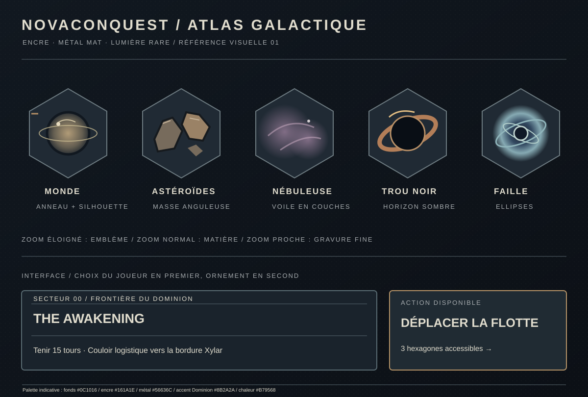

# Atlas graphique des cartes

Cette planche fixe une direction pour la carte tactique : métal mat, lumière rare, silhouettes nettes, matière discrète. Elle sert de cible visuelle pour le thème par défaut, pas de calque pixel par pixel pour les variantes saisonnières. Les couleurs des terrains et les propriétaires continuent à venir du thème actif.

| Distance | Carte | Détail attendu |
| --- | --- | --- |
| Zoom éloigné, inférieur à 0,7× | Emblèmes vectoriels | Silhouette du terrain et faction, sans texture coûteuse ni étiquette de secteur. |
| Zoom normal, de 0,7× à moins de 1,5× | Rendu actuel | Dégradés, hachures, trajectoires et états de jeu. |
| Zoom proche, à partir de 1,5× | Rendu + gravure | Détails fins sur mondes, astéroïdes, nébuleuses, trous noirs et failles. |

Les motifs vectoriels sont définis dans `app/src/main/kotlin/com/novaempire/app/ui/map/MapArt.kt`. La grille, les unités, la sélection, le brouillard et les cibles restent dans les couches tactiques existantes. Pour l'UI, cette planche est une référence de composition et de contraste ; elle ne remplace aucun écran dans cette étape.

Avant de décliner ces motifs sur d'autres écrans, contrôler une capture en thème par défaut, WINTER et HALLOWEEN, à chaque niveau de zoom et sur un téléphone compact. Les emblèmes éclaircissent la couleur du terrain propre au thème sans modifier les règles de la carte.
